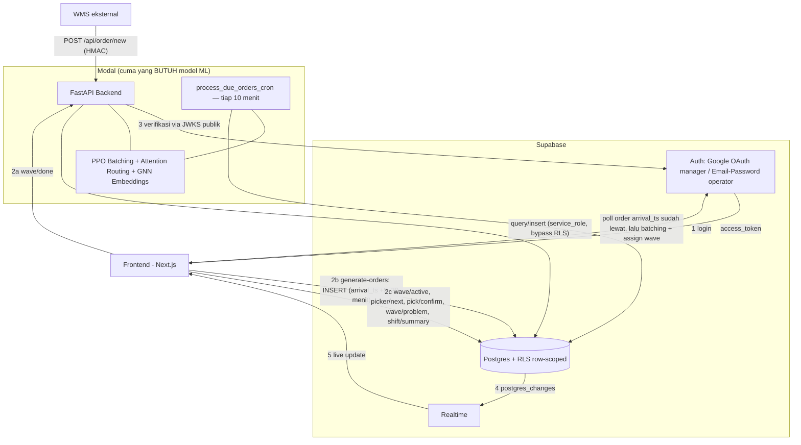

# NexWave API Contract

Base URL:
```
https://farelfebryan06--nexwave-api-fastapi-app.modal.run
```

---

## Arsitektur



---

## Alur data

1. **Login** — frontend bicara langsung ke Supabase (bukan ke backend), dapat `access_token`. Dua jalur: Google (role `manager`) atau email/password akun dummy (role `operator`). Detail implementasi: [frontend_auth.md](frontend_auth.md).
2. **Dua jalur beda buat sisanya**, tergantung butuh model ML atau nggak:
   - **Lewat Modal** (`wave/done`, + `dev/process-pending-orders` buat testing manual) — frontend kirim `Bearer access_token`, backend verifikasi via JWKS Supabase, cek role, baru query DB pakai `service_role` (bypass RLS).
   - **Langsung ke Supabase** (`generate-orders`, `wave/active`, `picker/next`, `pick/confirm`, `wave/problem`, `shift/summary`) — frontend query/insert tabel pakai client Supabase yang sudah login, **RLS row-scoped** (`schema.sql` STEP 7-8) yang jaga akses-nya, bukan kode backend. Detail: [frontend_auth.md](frontend_auth.md#7-operasi-langsung-ke-supabase-bukan-lewat-modal).
3. **Dua sumber order, satu pipeline batching**:
   - **WMS asli** — `POST /api/order/new` (HMAC) → insert ke `orders` → PPO batching agent langsung putuskan `add`/`close_wave` saat itu juga (`arrival_ts` = sekarang).
   - **Generate dummy (testing)** — manager `INSERT` langsung ke `orders` dari frontend (Supabase langsung, bukan lewat Modal), `arrival_ts` di-set acak 5-20 menit ke depan. `process_due_orders_cron` (Modal, jadwal tiap 10 menit) polling order yang `arrival_ts`-nya udah lewat, baru masuk ke PPO batching agent -- sama persis prosesnya dengan jalur WMS, cuma telat beberapa menit dan sekali proses bisa gabung banyak order at once.
   Kedua jalur berujung sama: wave yang closed dapat baris `wave_locations`, lalu di-assign ke picker available (rute dihitung Attention Routing Model + Nav graph).
4. **Realtime** — perubahan di DB (dari proses batching di atas, atau langsung dari operator lewat query Supabase) otomatis sampai ke frontend yang subscribe lewat Supabase Realtime, tanpa polling.

---

## Auth (ringkas)

| Role | Login | Akses |
|---|---|---|
| `manager` | Google OAuth | Semua endpoint — semua order, wave, rute tiap operator |
| `operator` | Email/password (akun dummy) | Rute wave miliknya sendiri saja |

```typescript
await supabase.auth.signInWithOAuth({ provider: 'google' })       // manager
await supabase.auth.signInWithPassword({ email, password })       // operator
const { data: { session } } = await supabase.auth.getSession()
fetch(`${API_URL}/...`, { headers: { Authorization: `Bearer ${session?.access_token}` } })
```
---

## Endpoints

| Method & Path | Role | Fungsi | Lewat |
|---|---|---|---|
| `GET /health` | - | Cek backend hidup, model ke-load | Modal |
| `POST /api/order/new` | *(HMAC, bukan Bearer)* | Order baru dari WMS → masuk batching agent | Modal |
| `GET /api/wave/active` 🔒 | manager | Semua wave aktif + lokasinya (peta gudang) | **Supabase langsung** |
| `GET /api/picker/{picker_id}/next` | operator (diri sendiri) / manager | Rute wave berjalan milik satu picker | **Supabase langsung** |
| `POST /api/pick/confirm` | operator / manager | Konfirmasi satu lokasi selesai dipick | **Supabase langsung** |
| `POST /api/wave/problem` | operator / manager | Laporkan masalah di satu lokasi | **Supabase langsung** |
| `POST /api/wave/done` | operator / manager | Tutup wave, minta wave berikutnya | Modal *(butuh Attention Routing buat wave berikutnya)* |
| `GET /api/shift/summary` 🔒 | manager | Ringkasan shift hari ini | **Supabase langsung** |
| `POST /rest/v1/orders` (`generate-orders`) 🔒 | manager | Generate order dummy (35-70 random), `arrival_ts` +5..20 menit | **Supabase langsung** |
| `POST /api/dev/process-pending-orders` 🔒 | manager | Trigger manual proses order yang udah due (testing, tanpa nunggu cron) | Modal |

Endpoint yang ditandai **Supabase langsung** (kecuali `generate-orders`, lihat catatan di bawah) MASIH ada di `modal_app.py` (nggak dihapus, aman buat testing lewat Postman/curl pakai Bearer token seperti biasa), tapi frontend production sebaiknya nggak manggil versi Modal-nya lagi — pakai query langsung ([frontend_auth.md](frontend_auth.md#7-operasi-langsung-ke-supabase-bukan-lewat-modal)), jauh lebih cepat (nggak ada extra hop + cold start Modal) buat operasi yang toh cuma SQL doang.

`generate-orders` beda dari 5 lainnya: bukan cuma "dianjurkan pindah", rute Modal-nya **dihapus total** -- murni `INSERT`, nggak ada logic yang perlu dijaga backend. Model ML dipanggil BELAKANGAN oleh `process_due_orders_cron`, bukan saat generate (lihat [Alur data](#alur-data) poin 3).

### `GET /health`
Satu-satunya endpoint tanpa auth — buat cek backend hidup & model sudah ke-load sebelum debug hal lain (uptime check, atau langkah pertama pas troubleshoot).
```json
{ "status": "ok", "models": "loaded", "version": "v11" }
```

### `POST /api/order/new`
**Bukan dipanggil frontend** — ini webhook dari sistem WMS eksternal tiap ada order baru. Insert ke `orders`, lalu trigger batching agent buat mutusin order ini gabung ke wave yang lagi jalan atau nutup wave itu. Disebut di sini cuma buat konteks kenapa wave-wave di endpoint lain bisa muncul.
Auth beda — HMAC (`X-Wms-Signature`), bukan Bearer token.
Response: `{ "action": "add", "wave_id": "WAVE-DEMO-002", "order_id": "ORD-2026-000110" }` (`action` bisa `"add"` atau `"close_wave"`)

### `GET /api/wave/active` — **Supabase langsung**, bukan Modal
Buat render peta gudang di dashboard manager — semua wave yang lagi berjalan (belum `done`) beserta status tiap lokasi di dalamnya. Dipanggil pas dashboard dibuka; update selanjutnya idealnya lewat Realtime (lihat [Alur data](#alur-data) poin 4), bukan polling ulang. Cara query: [frontend_auth.md](frontend_auth.md#7-operasi-langsung-ke-supabase-bukan-lewat-modal). Bentuk response (kontrak, sama biar frontend nggak perlu ubah kode konsumsinya):
```json
[{ "wave_id": "WAVE-DEMO-002", "status": "in_progress", "picker_id": 1, "picker_name": "Operator 1",
   "total_items": 14, "total_distance": 2148.0,
   "locations": [
     { "location_id": "F-13-11", "visit_order": 1, "status": "picked",
       "product_ref": "2LPO6D", "qty": 2, "x": 368, "y": 392, "z": 1 },
     { "location_id": "D-13-21", "visit_order": 2, "status": "active",
       "product_ref": "1D2ILZ", "qty": 5, "x": 368, "y": 212, "z": 2 }
   ] }]
```
Cuma wave `forming`/`assigned`/`in_progress`. `locations[].status`: `pending` → `active` → `picked`, atau `problem`.

### `GET /api/picker/{picker_id}/next` — **Supabase langsung**, bukan Modal
Buat app picker (operator) — nunjukkin wave yang lagi ditugaskan ke dia dan urutan lokasi yang harus dikunjungi. Dipanggil pas operator buka app-nya, atau setelah `wave/done` buat lihat wave berikutnya. Cara query: [frontend_auth.md](frontend_auth.md#7-operasi-langsung-ke-supabase-bukan-lewat-modal). `picker_id` bukan milik sendiri → RLS filter diam-diam, hasilnya identik sama "tidak ada wave" (`no_wave`), BUKAN `403` seperti versi Modal lama.
```json
{ "wave_id": "WAVE-DEMO-002", "status": "in_progress", "total_items": 14, "total_distance": 2148.0,
  "route": [
    { "step": 1, "location_id": "F-13-11", "product_ref": "2LPO6D", "qty": 2,
      "floor": 1, "x": 368, "y": 392, "status": "picked",
      "instruction": "Ambil 2 unit 2LPO6D di F-13-11" },
    { "step": 2, "location_id": "D-13-21", "product_ref": "1D2ILZ", "qty": 5,
      "floor": 2, "x": 368, "y": 212, "status": "active",
      "instruction": "Naik ke Lantai 2 — Ambil 5 unit 1D2ILZ di D-13-21" }
  ] }
```
Tanpa wave (atau bukan milik sendiri, lihat catatan di atas): `{ "wave_id": null, "status": "no_wave", "message": "Tidak ada wave tersedia." }`.

### `POST /api/pick/confirm` — **Supabase langsung**, bukan Modal
Dipanggil operator tiap kali selesai ambil barang di satu lokasi (mis. abis scan barcode) — update status lokasi itu jadi `picked` dan kasih tau progress wave + lokasi berikutnya yang harus dituju. Cara query (UPDATE + SELECT, dua call, tetep jauh lebih cepat dari satu call ke Modal): [frontend_auth.md](frontend_auth.md#7-operasi-langsung-ke-supabase-bukan-lewat-modal). RLS `operator_update_own_wave_locations` yang jaga — operator cuma bisa update wave miliknya sendiri, row lain affect 0 diam-diam.

Request: 
```json
{ "wave_id": "WAVE-DEMO-002", "location_id": "F-13-11", "qty_actual": 2 }
```
Response: 
```json 
{ "status": "ok", "location_id": "F-13-11", "wave_progress": { "picked": 1, "total": 6, "pct": 16.7 }, "next_location": { "location_id": "D-13-21", "product_ref": "1D2ILZ", "qty": 5 } }
```

(`next_location` bisa `null` kalau semua lokasi sudah `picked`)

### `POST /api/wave/problem` — **Supabase langsung**, bukan Modal
Dipanggil operator kalau ada kendala di satu lokasi (stok habis, barang rusak, dll) — nandain lokasi itu `problem` biar keliatan di dashboard manager dan bisa ditindaklanjuti, bukan bikin operator stuck di lokasi itu. Cara query: [frontend_auth.md](frontend_auth.md#7-operasi-langsung-ke-supabase-bukan-lewat-modal).

Request: 

```json
{ "wave_id": "WAVE-DEMO-002", "location_id": "D-13-21", "reason": "stok_habis" }
``` 
(`reason` bebas, tidak ada enum yang di-enforce)

Response: 

```json
{ "status": "ok", "location_status": "problem" }
```

### `POST /api/wave/done`
Dipanggil operator setelah SEMUA lokasi di wave-nya selesai dipick — nutup wave itu (status jadi `done`), bebasin picker-nya, terus langsung nyari wave `forming` berikutnya buat di-assign ke picker yang sama (biar nggak nganggur nunggu).

Request: 
```json
{ "wave_id": "WAVE-DEMO-002" }
```
Response:
```json
{ "status": "ok", "wave_summary": { "wave_id": "WAVE-DEMO-002", "total_items": 14, "total_distance": 2148.0 }, "next_wave": { "wave_id": "WAVE-DEMO-003" } }
```

(`next_wave` bisa `null` kalau tidak ada wave `forming` yang nunggu picker)
`wave_id` invalid → `500` (pakai `wave_id` dari `/api/picker/{id}/next`, jangan diketik manual).

### `GET /api/shift/summary` — **Supabase langsung**, bukan Modal
Angka agregat buat header dashboard manager (jumlah wave, item, jarak hari ini) — dihitung on-the-fly dari `waves`+`orders` hari itu. Nggak butuh Realtime, polling tiap 30 detik cukup. Cara query (filter range tanggal, bukan `DATE(created_at)`): [frontend_auth.md](frontend_auth.md#7-operasi-langsung-ke-supabase-bukan-lewat-modal).
```json
{ "shift_date": "2026-08-23", "n_waves": 5, "waves_done": 2, "waves_active": 2, "waves_forming": 1,
  "total_items": 70, "items_picked": 24, "total_distance": 8010.0, "dist_per_item": 114.4 }
```

### `POST /rest/v1/orders` (`generate-orders`) — **Supabase langsung**, bukan Modal sama sekali
`POST` di sini ke REST API-nya Supabase sendiri (PostgREST), BUKAN ke `/api/...` kita — dipanggil otomatis oleh `supabase.from('orders').insert(...)`, gak ada URL yang perlu diketik manual.
Dipanggil manager buat testing/demo — generate order dummy (35-70 random, `product_ref` dari `product_catalog`, `location_id` dari `locations`) langsung `INSERT` ke tabel `orders`, TANPA lewat backend/model. `arrival_ts` di-set acak **5-20 menit ke depan** (bukan sekarang) — order baru masuk ke PPO batching agent belakangan lewat `process_due_orders_cron` ([Arsitektur](#arsitektur)), bukan saat generate. Cara insert: [frontend_auth.md](frontend_auth.md#7-operasi-langsung-ke-supabase-bukan-lewat-modal). RLS `manager_insert_orders` yang jaga — operator kena RLS violation kalau coba insert.

### `POST /api/dev/process-pending-orders`
Trigger manual buat `run_due_orders_cycle()` — fungsi yang SAMA yang otomatis jalan tiap 10 menit lewat `process_due_orders_cron` di Modal. Dipakai buat testing tanpa nunggu tick cron berikutnya (mis. abis `generate-orders`, mau langsung lihat hasilnya di dashboard). Nyari semua `orders` dengan `status='pending'`, `wave_id IS NULL`, `arrival_ts` udah lewat, proses lewat PPO batching agent, assign wave yang forming ke picker available.
```json
{ "status": "ok", "processed": 12,
  "batching_actions": { "add": 9, "close_wave": 3 },
  "waves_assigned": [{ "wave_id": "WAVE-DEMO-004", "picker_id": 3 }] }
```
Nggak ada order due: `{ "status": "ok", "processed": 0, "batching_actions": {}, "waves_assigned": [] }`. `wave_id` di sini format UUID asli (`uuid.uuid4()`) — `"WAVE-DEMO-..."` di contoh lain di dokumen ini cuma penamaan dummy data buat gampang dibaca, lihat [dummy_data/](dummy_data/).
