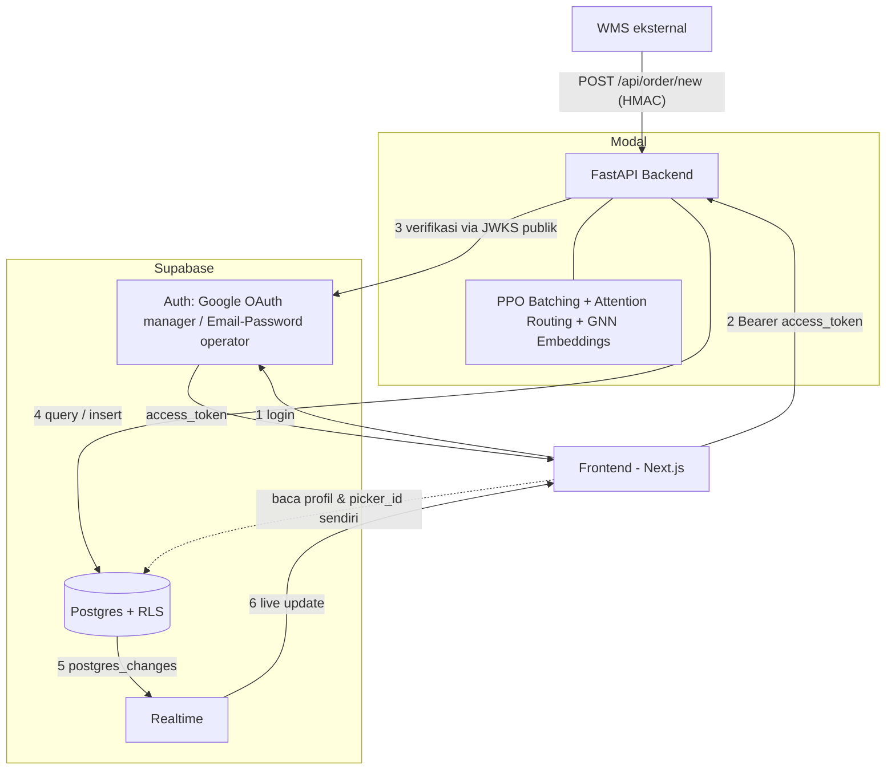

# NexWave API Contract

Base URL:
```
https://farelfebryan06--nexwave-api-fastapi-app.modal.run
```

---

## Arsitektur



---

## Alur data

1. **Login** — frontend bicara langsung ke Supabase (bukan ke backend), dapat `access_token`. Dua jalur: Google (role `manager`) atau email/password akun dummy (role `operator`). Detail implementasi: [frontend_auth.md](frontend_auth.md).
2. **Tiap call ke API** — frontend kirim `access_token` sebagai `Authorization: Bearer ...`. Backend verifikasi pakai kunci publik JWKS Supabase (bukan secret bersama), lalu cek role (`profiles.role`) + `picker_id` (`pickers.auth_user_id`) buat nentuin akses.
3. **Order masuk** — WMS panggil `POST /api/order/new` (HMAC, bukan Bearer) → insert ke `orders` → PPO batching agent putuskan `add` ke wave berjalan atau `close_wave`. Wave yang closed dapat baris `wave_locations`, lalu di-assign ke picker available (rute dihitung Attention Routing Model + Nav graph).
4. **Picker kerja** — operator `GET /api/picker/{id}/next` (cuma punya sendiri) → `POST /api/pick/confirm` per lokasi → update `wave_locations`/`orders`.
5. **Realtime** — perubahan di DB (poin 3-4) otomatis sampai ke frontend yang subscribe lewat Supabase Realtime, tanpa polling.

---

## Auth (ringkas)

| Role | Login | Akses |
|---|---|---|
| `manager` | Google OAuth | Semua endpoint — semua order, wave, rute tiap operator |
| `operator` | Email/password (akun dummy) | Rute wave miliknya sendiri saja |

```typescript
await supabase.auth.signInWithOAuth({ provider: 'google' })       // manager
await supabase.auth.signInWithPassword({ email, password })       // operator
const { data: { session } } = await supabase.auth.getSession()
fetch(`${API_URL}/...`, { headers: { Authorization: `Bearer ${session?.access_token}` } })
```
---

## Endpoints

| Method & Path | Role | Fungsi |
|---|---|---|
| `GET /health` | - | Cek backend hidup, model ke-load |
| `POST /api/order/new` | *(HMAC, bukan Bearer)* | Order baru dari WMS → masuk batching agent |
| `GET /api/wave/active` 🔒 | manager | Semua wave aktif + lokasinya (peta gudang) |
| `GET /api/picker/{picker_id}/next` | operator (diri sendiri) / manager | Rute wave berjalan milik satu picker |
| `POST /api/pick/confirm` | operator / manager | Konfirmasi satu lokasi selesai dipick |
| `POST /api/wave/problem` | operator / manager | Laporkan masalah di satu lokasi |
| `POST /api/wave/done` | operator / manager | Tutup wave, minta wave berikutnya |
| `GET /api/shift/summary` 🔒 | manager | Ringkasan shift hari ini |
| `POST /api/dev/generate-orders` 🔒 | manager | **[Prototype]** generate 35-70 order random buat testing |

### `GET /health`
Satu-satunya endpoint tanpa auth — buat cek backend hidup & model sudah ke-load sebelum debug hal lain (uptime check, atau langkah pertama pas troubleshoot).
```json
{ "status": "ok", "models": "loaded", "version": "v11" }
```

### `POST /api/order/new`
**Bukan dipanggil frontend** — ini webhook dari sistem WMS eksternal tiap ada order baru. Insert ke `orders`, lalu trigger batching agent buat mutusin order ini gabung ke wave yang lagi jalan atau nutup wave itu. Disebut di sini cuma buat konteks kenapa wave-wave di endpoint lain bisa muncul.
Auth beda — HMAC (`X-Wms-Signature`), bukan Bearer token.
Response: `{ "action": "add", "wave_id": "WAVE-DEMO-002", "order_id": "ORD-2026-000110" }` (`action` bisa `"add"` atau `"close_wave"`)

### `GET /api/wave/active`
Buat render peta gudang di dashboard manager — semua wave yang lagi berjalan (belum `done`) beserta status tiap lokasi di dalamnya. Dipanggil pas dashboard dibuka; update selanjutnya idealnya lewat Realtime (lihat [Alur data](#alur-data) poin 5), bukan polling endpoint ini berulang.
```json
[{ "wave_id": "WAVE-DEMO-002", "status": "in_progress", "picker_id": 1, "picker_name": "Operator 1",
   "total_items": 14, "total_distance": 2148.0,
   "locations": [
     { "location_id": "F-13-11", "visit_order": 1, "status": "picked",
       "product_ref": "2LPO6D", "qty": 2, "x": 368, "y": 392, "z": 1 },
     { "location_id": "D-13-21", "visit_order": 2, "status": "active",
       "product_ref": "1D2ILZ", "qty": 5, "x": 368, "y": 212, "z": 2 }
   ] }]
```
Cuma wave `forming`/`assigned`/`in_progress`. `locations[].status`: `pending` → `active` → `picked`, atau `problem`.

### `GET /api/picker/{picker_id}/next`
Buat app picker (operator) — nunjukkin wave yang lagi ditugaskan ke dia dan urutan lokasi yang harus dikunjungi. Dipanggil pas operator buka app-nya, atau setelah `wave/done` buat lihat wave berikutnya.
```json
{ "wave_id": "WAVE-DEMO-002", "status": "in_progress", "total_items": 14, "total_distance": 2148.0,
  "route": [
    { "step": 1, "location_id": "F-13-11", "product_ref": "2LPO6D", "qty": 2,
      "floor": 1, "x": 368, "y": 392, "status": "picked",
      "instruction": "Ambil 2 unit 2LPO6D di F-13-11" },
    { "step": 2, "location_id": "D-13-21", "product_ref": "1D2ILZ", "qty": 5,
      "floor": 2, "x": 368, "y": 212, "status": "active",
      "instruction": "Naik ke Lantai 2 — Ambil 5 unit 1D2ILZ di D-13-21" }
  ] }
```
Tanpa wave (bukan error, tetap 200): `{ "wave_id": null, "status": "no_wave", "message": "Tidak ada wave tersedia." }`. `picker_id` bukan milik sendiri → `403`.

### `POST /api/pick/confirm`
Dipanggil operator tiap kali selesai ambil barang di satu lokasi (mis. abis scan barcode) — update status lokasi itu jadi `picked` dan kasih tau progress wave + lokasi berikutnya yang harus dituju.

Request: 
```json
{ "wave_id": "WAVE-DEMO-002", "location_id": "F-13-11", "qty_actual": 2 }
```
Response: 
```json 
{ "status": "ok", "location_id": "F-13-11", "wave_progress": { "picked": 1, "total": 6, "pct": 16.7 }, "next_location": { "location_id": "D-13-21", "product_ref": "1D2ILZ", "qty": 5 } }
```

(`next_location` bisa `null` kalau semua lokasi sudah `picked`)

### `POST /api/wave/problem`
Dipanggil operator kalau ada kendala di satu lokasi (stok habis, barang rusak, dll) — nandain lokasi itu `problem` biar keliatan di dashboard manager dan bisa ditindaklanjuti, bukan bikin operator stuck di lokasi itu.

Request: 

```json
{ "wave_id": "WAVE-DEMO-002", "location_id": "D-13-21", "reason": "stok_habis" }
``` 
(`reason` bebas, tidak ada enum yang di-enforce)

Response: 

```json
{ "status": "ok", "location_status": "problem" }
```

### `POST /api/wave/done`
Dipanggil operator setelah SEMUA lokasi di wave-nya selesai dipick — nutup wave itu (status jadi `done`), bebasin picker-nya, terus langsung nyari wave `forming` berikutnya buat di-assign ke picker yang sama (biar nggak nganggur nunggu).

Request: 
```json
{ "wave_id": "WAVE-DEMO-002" }
```
Response:
```json
{ "status": "ok", "wave_summary": { "wave_id": "WAVE-DEMO-002", "total_items": 14, "total_distance": 2148.0 }, "next_wave": { "wave_id": "WAVE-DEMO-003" } }
```

(`next_wave` bisa `null` kalau tidak ada wave `forming` yang nunggu picker)
`wave_id` invalid → `500` (pakai `wave_id` dari `/api/picker/{id}/next`, jangan diketik manual).

### `GET /api/shift/summary`
Angka agregat buat header dashboard manager (jumlah wave, item, jarak hari ini) — dihitung on-the-fly dari `waves`+`orders` hari itu. Nggak butuh Realtime, polling tiap 30 detik cukup.
```json
{ "shift_date": "2026-08-23", "n_waves": 5, "waves_done": 2, "waves_active": 2, "waves_forming": 1,
  "total_items": 70, "items_picked": 24, "total_distance": 8010.0, "dist_per_item": 114.4 }
```

### `POST /api/dev/generate-orders`
Dipanggil manager buat testing/demo — simulasi WMS ngirim banyak order sekaligus (35-70 random, produk & lokasi asli dari DB/model) tanpa harus nunggu WMS beneran terhubung. Diproses lewat pipeline batching yang sama dengan `/api/order/new`, wave yang terbentuk langsung dicoba di-assign ke picker available, jadi habis manggil ini dashboard & app picker langsung ada isinya.
```json
{ "status": "ok", "generated": 47,
  "order_ids": ["ORD-GEN-A1B2C3D4E5", "ORD-GEN-9F8E7D6C5B", "(45 order_id lagi, total = generated)"],
  "batching_actions": { "add": 40, "close_wave": 7 },
  "waves_assigned": [{ "wave_id": "WAVE-DEMO-004", "picker_id": 3 }] }
```
`wave_id` di sini format UUID asli (`uuid.uuid4()`) — `"WAVE-DEMO-..."` di contoh lain di dokumen ini cuma penamaan dummy data buat gampang dibaca, lihat [dummy_data/](dummy_data/).
